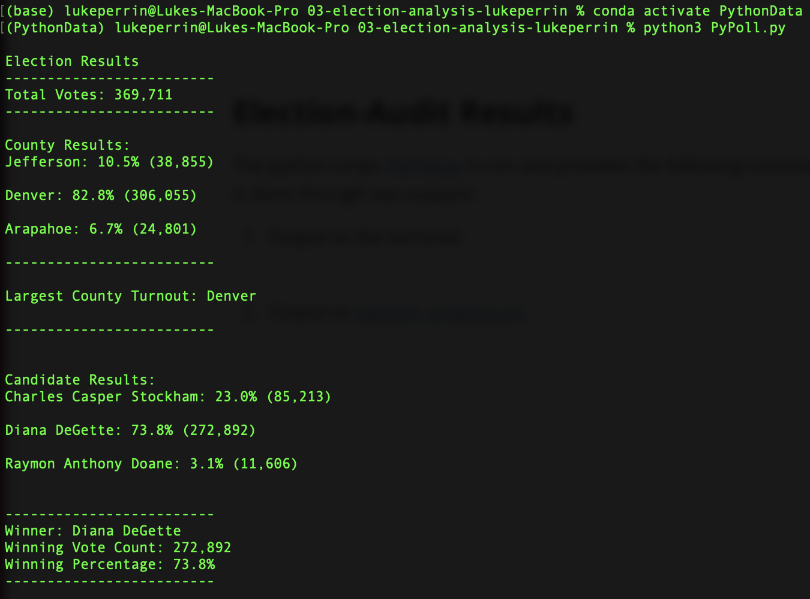
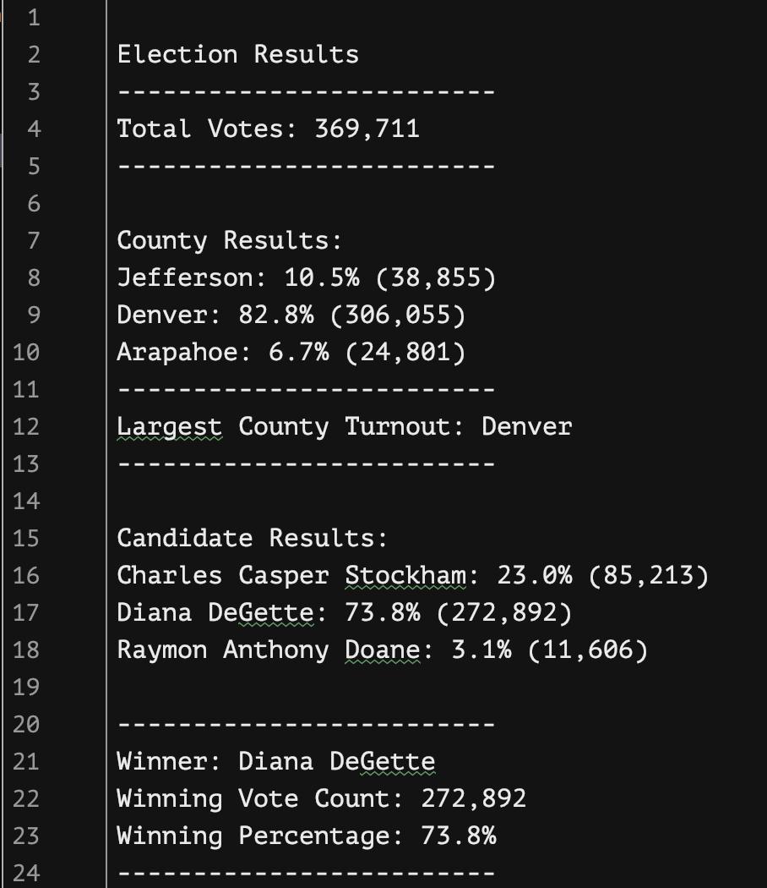

# Module 3 | Assignment - PyPoll

## Overview of Election Audit

Seth and Tom are looking to count votes for a local Colorado election audit. They have a [CSV file of election results](https://github.com/luperrin/03-election-analysis-lukeperrin/blob/main/Resources/election_results.csv) that they need to count election results for. However, the file has 369,711 rows and need some way to process the file without having to count each row one by one. The task at hand requires a python script which reads the CSV file and summarizes the election results in an effective manner.

## Election Audit Results

The python script, [PyPoll.py](https://github.com/luperrin/03-election-analysis-lukeperrin/blob/main/PyPoll.py) is run and provides the following summary of the election, this is done through two outputs:

1. Output to the terminal:

   

2. Output to [election_analysis.txt](https://github.com/luperrin/03-election-analysis-lukeperrin/blob/main/Analysis/election_analysis.txt):

   

As indicated by both outputs, the following conclusions can be drawn:

- 369,711 votes were cast in this congressional election
- Each county in the precinct contributed the following votes respectively:
  - Jefferson: 10.5% (38,855)
  - Denver: 82.8% (306,055) 
  - Arapahoe: 6.7% (24,801)
- Of these, Denver county had the largest number of votes
- Each candidate received the following number of votes respectively:
  - Charles Casper Stockham: 23.0% (85,213)
  - Diana DeGette: 73.8% (272,892)
  - Raymon Anthony Doane: 3.1% (11,606)
- Of these, the winner was determined to be:
  - Winner: Diana DeGette
  - Winning Vote Count: 272,892
  - Winning Percentage: 73.8%

## Election Audit Summary

Beyond the summarization of this election’s results, this python script can be used to summarize other elections as well by either substituting the data in `election_results.csv`, or by changing the script to analyze a different file instead with corresponding election result data. 

Furthermore, the script can also be supplemented to analyze other voting factors as well should the data be stored in additional columns (e.g. gender in `row[3]`, race/ethnicity in `row[4]`,  household income in `row[5]`, etc… to `row[n]`). By analyzing these voting factors, politicians running in these elections may better understand the demographics of the population they are looking to represent and thus campaign effectively toward the people in these counties.

